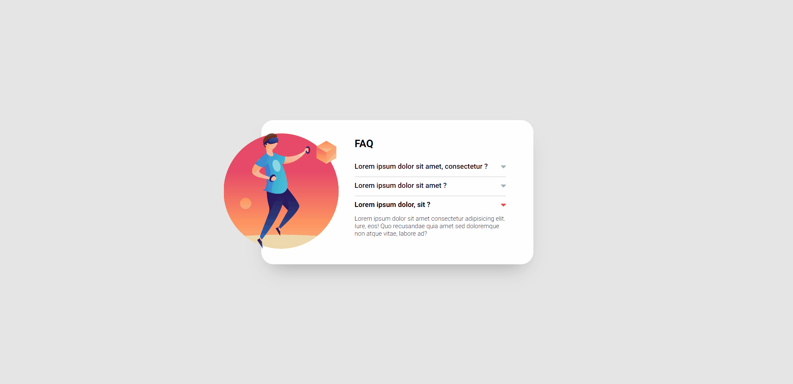

# Acordeon - FAC

Esta foi a solução para um exercício no qual enfrentei o desafio de criar um acordeão de FAQ no estilo daquele presente no site da Netflix.

## Sumário

- [Visão Geral](#visão-geral)
  - [Captura de tela](#captura-de-tela)
  - [Links](#links)
- [Meu Processo](#meu-processo)
  - [Construído com](#construído-com)
  - [O que aprendi](#o-que-aprendi)
- [Autor](#autor)

## Visão Geral

### Captura de tela

### Links

- [URL do site](https://m4th3us-br1t0.github.io/acordeon-js-simples/)

## Meu Processo

### Construído com

- Marcação HTML5 semântica.
- Flexbox.
- Pseudo-classe.
- Media Queries.
- Eventos do DOM.
- Manipulação de elementos do DOM.

### O que aprendi

Neste projeto, pude aprimorar minhas habilidades ao manipular elementos do DOM com JavaScript e trabalhar com eventos.

## Autor

- Linkedin - [Matheus-Brito](https://www.linkedin.com/in/matheus-brito06/)